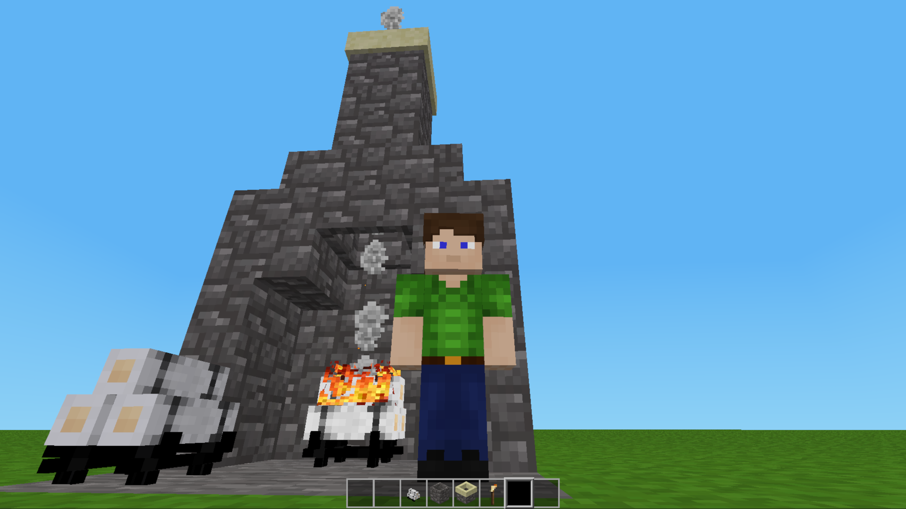

# Chimney_MTG Mod for Luanti (Minetest Game)

Adds decorative **Chimneys**, matching **Chimney Tops**, and functional interactive **Fire Logs** to your Minetest World.

Designed specifically for **Minetest Game (MTG)**

## Features

- **Hollow Chimney Flue & Top:**
- **Interactive Fire Logs:**
  - **Ignition:** Wield a standard `default:torch` and left-click (punch) the unlit logs to light them up.
  - **Extinguish:** Left-click (punch) the burning logs with any tool, block, or bare hand to safely put out the fire.
  - **Campfire Roasting:** Click an inventory food item while holding an empty stick to load it up. Right-click the burning logs while holding a raw food stick to instantly toast it in your active slot.
- **Campfire Foods & Tools:**
  - Craft a reusable `Whittled Roasting Stick` out of basic sticks.
  - Left-click to eat your `Toasted Marshmallows` or `Cooked Sausages` to restore health, play a custom crunch sound, and return your empty stick back to your active slot.
- **Atmospheric Effects:**
  - Ambient fireplace audio / visual (fire_logs_burning) while lit.
  - The smoke particles float up to 8 blocks straight up inside your chimney shafts without clipping through walls, and so they billow out from the chimney top.
  - Tiny, glowing, floating embers/sparks for some extra, calming visual effects.
  - Emits (`light_source = 12`) and deals fire damage to entities standing directly on them.

## Crafting Recipes
(these may need to be changed, I am not good at doing recipes)

### Standard Chimney (Yields 4)
Place 6 blocks of your chosen base material in the left and right columns of the crafting grid (leaving the middle column empty).

### Chimney Top (Yields 2)
Place 1 block of your base material on the left, 1 standard chimney of that variant in the center, and 1 more block of the base material on the right.

## Installation & Dependencies

1. Clone or download this repository into your Luanti `mods/` directory.
2. Ensure the folder name is strictly lowercase: `chimney_mtg`
3. Enable the mod in your world settings.

**Dependencies:** `default` (from Minetest Game)

## License

- **Code:** MIT License
- **Assets (Models, Textures, Audio):** CC BY-SA 4.0 (Creative Commons Attribution-ShareAlike)

## Credits & Inspiration

This mod was inspired by the original [Chimney](https://content.luanti.org/packages/Frederik/chimney/) mod created by **Tomlaus (Frederik)** for Mineclone and Mineclonia.

My original intent was to just port the mod to Minetest Game, but then I started thinking about adding more to it. One thing led to another, and I just created an entirely new mod and decided to name it `chimney_mtg`.

